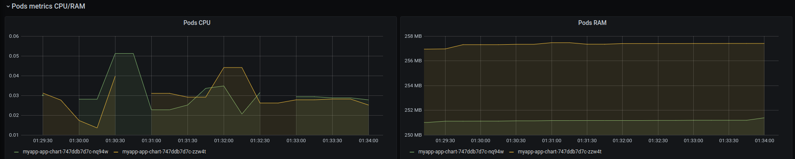
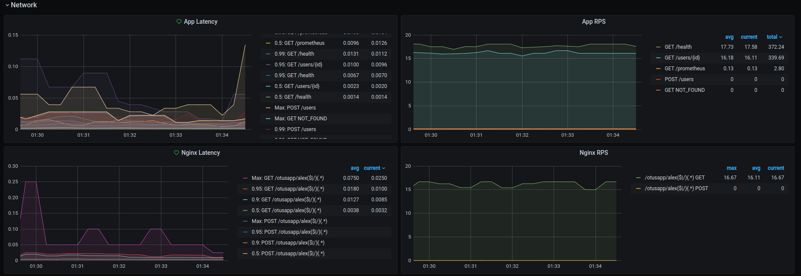
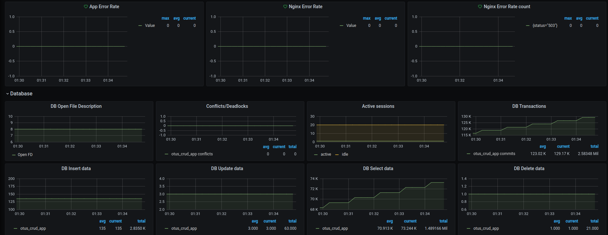

# ДЗ №3 - Prometheus. Grafana. 

Prometheus. Grafana
Инструментировать сервис из прошлого задания метриками в формате Prometheus с помощью библиотеки для вашего фреймворка и ЯП.

Сделать дашборд в Графане, в котором были бы метрики с разбивкой по API методам:
1. Latency (response time) с квантилями по 0.5, 0.95, 0.99, max
2. RPS
3. Error Rate - количество 500ых ответов

Добавить в дашборд графики с метрикам в целом по сервису, взятые с nginx-ingress-controller:
1. Latency (response time) с квантилями по 0.5, 0.95, 0.99, max
2. RPS
3. Error Rate - количество 500ых ответов

Настроить алертинг в графане на Error Rate и Latency.

На выходе должно быть:
0) скриншоты дашборды с графиками в момент стресс-тестирования сервиса. Например, после 5-10 минут нагрузки.
1) json-дашборды.


Задание со звездочкой (+5 баллов)
Используя существующие системные метрики из кубернетеса, добавить на дашборд графики с метриками:
1. Потребление подами приложения памяти
2. Потребление подами приолжения CPU

Инструментировать базу данных с помощью экспортера для prometheus для этой БД.
Добавить в общий дашборд графики с метриками работы БД.


## Запустить проект

```
helm install myapp ./app-chart
```

#### Запустить grafana-у
```
kubectl port-forward service/myapp-grafana 9000:80
```

```
username: admin
password: password 
```

#### Запустить prometheus
```
kubectl port-forward service/prometheus-operated 9090
```

## Grafana



